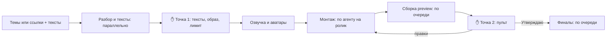

# Модуль 7. Пакет роликов

**Цель модуля:** вы делаете 5–10 роликов за раз и участвуете только в двух точках: утверждаете
тексты в начале и ролики в пульте в конце.

**Время:** пакет из 10 роликов (5 тем × 2 варианта) у нас занял один день вместе с двумя кругами
правок.

**До начала:** вы хотя бы раз прошли модули 2–6 на одном ролике. Пакет – это те же шаги, только
для нескольких роликов сразу.

---

## Как устроен пакет

Всё, что можно делать параллельно, агент делает параллельно: разбирает референсы, пишет тексты,
расшифровывает речь, пишет анимации. Собирает видео строго по одному – так быстрее и надёжнее.

---

## Шаг 1. Дайте материал одним сообщением

**Что вы делаете.**

> Сделай пакет роликов. Темы и ссылки на референсы:
> 1. <тема или ссылка>
> 2. <тема или ссылка>
> …
> Тексты – мои, вот они: <тексты> (или: напиши тексты по референсам моим голосом).
> У каждой темы два варианта: Instagram с кодовым словом и YouTube с призывом подписаться.
> Названия карточек начинай с «Пакет <N> · ». Путь – аватар, образ <название>.
> Маршрут монтажа – Creative Motion. Музыка – из папки <путь>,
> у каждого ролика своя. Правила монтажа для каждого ролика:
> <вставьте сюда целиком 10 правил из модуля 4 или из шпаргалки>

**Что делает агент.** Разбирает референсы и готовит тексты, вычитывает их для озвучки, считает
символы и кредиты. Потом присылает всё одной таблицей.

---

## Шаг 2. Точка 1: утвердите всё разом ✋

**Что вы делаете.** Прочитайте тексты, проверьте расчёт кредитов и ответьте одним сообщением:

> Утверждаю тексты 1–5. Образ – <название>. Лимит – 260 кредитов. Создавай.

Лимит – это потолок. Если нужно больше, агент остановится и спросит.

**Что делает агент.** Озвучивает, рендерит аватары, заводит проекты, монтирует каждый ролик
отдельным помощником-агентом, собирает preview по очереди и кладёт их в пульт. Два варианта одной
темы – в одной карточке, весь пакет находится поиском по его названию.

---

## Шаг 3. Точка 2: пульт ✋

Работайте в пульте как в [модуле 5](05-pult.md), с двумя отличиями.

- **Общие правки пишите один раз в чат.** «Для всех роликов пакета: эффекты на 5 дБ тише, музыку
  на 3 дБ громче». Агент применит правку ко всем роликам.
- **Правки по конкретному ролику** – в пульте, на секунде, как обычно.

Когда закончите с правками, скопируйте фразы «Передать агенту» из нужных карточек и отправьте их
одним сообщением. Агент выполнит их по очереди и вернёт карточки в «Ждёт меня».

Утверждайте ролики по одному, по мере готовности. Агент соберёт финалы по очереди и проверит
каждый ([модуль 6](06-final.md)).

---

## Шаг 4. Итог пакета

**Что вы увидите.** Отчёт агента – таблица всех роликов:

- папка и финальный файл;
- длительность и громкость;
- результат проверки;
- отпечаток SHA-256.

В пульте все карточки пакета стоят в разделе «Готов».

---

## Проверьте себя

- [ ] Все тексты, образ и лимит утверждены одним сообщением.
- [ ] Правила монтажа вставлены в задание целиком, а не по частям.
- [ ] Общие правки написаны один раз в чат, частные – в пульте.
- [ ] У каждого варианта своя музыка.
- [ ] Пакет ведёт один чат.

## Грабли

| Что случилось | Как избежать |
|---|---|
| Три круга правок на весь пакет | Все 10 правил из модуля 4 – в первом же сообщении |
| Одна и та же правка громкости в десяти карточках | Общие правки – одним сообщением в чат «для всех роликов пакета» |
| Сборки стояли часами: две очереди ждали друг друга | Один пакет – один чат. Если карточки долго стоят «В работе» и непонятно почему, спросите агента: «Что сейчас собирается и что в очереди?» |
| Два чата взялись за один и тот же ролик | Каждый ролик ведёт тот чат, который его начал. Если тот чат закрыт, откройте новый в папке движка и вставьте фразу из пульта |
| Кредиты кончились раньше, чем ролики | Лимит на весь пакет – в точке 1, с запасом на одну переделку |

**Дальше:** [модуль 8. Права и публикация](08-publish.md).
