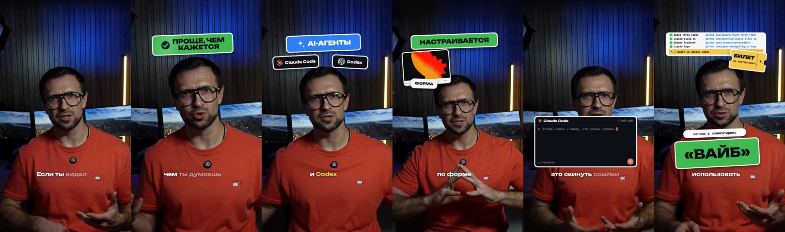
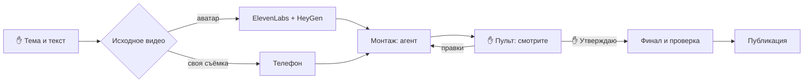

# Ролики с нуля: от идеи до готового видео

Пошаговый курс для человека, который не пишет код. За восемь коротких модулей вы пройдёте весь
путь: придумаете тему, получите видео со спикером, отдадите его на монтаж агенту, проверите
результат в «Пульте роликов» и заберёте готовый файл для Instagram и YouTube.

Курс собран по реальной работе 27–28 сентября 2026 года: за эти два дня так сделано 15
вертикальных роликов. Все цифры, примеры правок и ошибки ниже – оттуда.

## Что получится

Вертикальный ролик 9:16 на 1–2 минуты, который смотрится как работа монтажёра:

- **живая камера** – спикер не стоит на месте: медленный наезд, резкие смены крупности на
  акцентных словах, размытие под крупной графикой;
- **смена картинки каждые 2–2,5 секунды** – зрителю не скучно;
- **настоящие скриншоты** сайтов, постов и видео, о которых идёт речь, а не нарисованные макеты;
- **B-roll** – 3–4 короткие вставки готового видео из бесплатных библиотек (их называют стоком)
  по смыслу фразы;
- **звуковые эффекты** на каждое появление графики: щелчки, вылеты, набор текста;
- **музыка**, которая слышна, но не спорит с голосом;
- **два варианта** одной темы: для Instagram – с кодовым словом в конце, для YouTube – с призывом
  подписаться.

## Кто что делает

Монтирует агент – Claude Code или Codex, программа-помощник, с которой вы переписываетесь в чате.
Ваших действий шесть, и два из них – точки решения ✋, без которых агент дальше не пойдёт:

| Ваше действие | Где | Модуль |
|---|---|---|
| Дать тему или ссылку на ролик-референс и текст | чат с агентом | [2](02-idea-and-script.md) |
| ✋ Утвердить текст, для аватара – выбрать образ и лимит расходов | чат с агентом | [2](02-idea-and-script.md), [3](03-source-video.md) |
| Один раз выбрать способ монтажа | чат с агентом | [4](04-montage.md) |
| Посмотреть ролик целиком – preview, полную черновую сборку | пульт | [5](05-pult.md) |
| Оставить правки на нужной секунде | пульт | [5](05-pult.md) |
| ✋ Нажать «Утверждаю» | пульт | [5](05-pult.md) |

Всё остальное – расшифровку речи, дизайн, анимации, поиск скриншотов и стока, звук, сборку и
проверку файла – агент делает сам.

## Модули

| # | Модуль | После него вы умеете | Время |
|---|---|---|---|
| 1 | [Рабочее место](01-setup.md) | установить движок, пульт и навык аватара | один раз, 30–60 мин |
| 2 | [Идея и текст](02-idea-and-script.md) | выбрать тему или референс и подготовить текст к озвучке | 15–30 мин |
| 3 | [Исходное видео: аватар или своя съёмка](03-source-video.md) | получить видео со спикером | 20–45 мин ожидания |
| 4 | [Монтаж](04-montage.md) | поставить агенту задачу так, чтобы хватило одного круга правок | 5 мин ваших, ожидание 30 мин – 2 ч |
| 5 | [Пульт: смотрим, правим, утверждаем](05-pult.md) | проверить ролик и точно сказать, что поправить | 10–20 мин на ролик |
| 6 | [Финал](06-final.md) | забрать проверенный файл и понять отчёт проверки | 5 мин |
| 7 | [Пакет роликов](07-batch.md) | делать 5–10 роликов за раз | – |
| 8 | [Права и публикация](08-publish.md) | не нарушить лицензии и подготовить всё к выкладке | 10 мин |

Приложения: [готовые фразы для агента](PROMPTS.md) и [словарь терминов](GLOSSARY.md).

Проходите модули по порядку хотя бы один раз. Со второго ролика вам понадобятся только модули 2–6.

## Что понадобится

- Компьютер на macOS или Windows и подписка Claude Code или Codex.
- **Путь «аватар»:** аккаунт HeyGen с кредитами и, если хотите свой голос, ElevenLabs с клоном
  голоса. Оба сервиса платные – тарифы смотрите на их сайтах. Навык аватара работает на macOS и
  Linux; на Windows выбирайте путь «своя съёмка».
- **Путь «своя съёмка»:** телефон, который снимает вертикальное видео, тихая комната и свет на лицо.
- По желанию – бесплатный ключ Pexels для поиска стоковых видео.

## Честные цифры

Замеры из нашей работы 27–28 сентября:

| Что | Сколько |
|---|---|
| Текст | около 1 000 символов на минуту речи |
| Аватар HeyGen | около 32 кредитов за минуту видео |
| Рендер аватара | 20–45 минут ожидания |
| Первый preview с анимациями | от 30 минут до 2 часов работы агента |
| Новая версия после правок | 8–20 минут на ролик |
| Финал с проверкой | 5–15 минут на ролик |
| Пакет из 10 роликов (5 тем × 2 варианта) | от готовых текстов до 10 финалов – один день, два круга правок |
| Ваше время на один ролик | 20–40 минут: текст, просмотр, правки, утверждение |

## Что курс не делает

- Не публикует ролики в соцсети: вы выкладываете готовый файл сами (модуль 8).
- Не заменяет ваш вкус: агент делает дизайн сам, но что хорошо, а что нет, решаете вы в пульте.
- Не тратит ваши деньги без спроса: каждый платный вызов HeyGen или ElevenLabs агент сначала
  согласует с вами.
